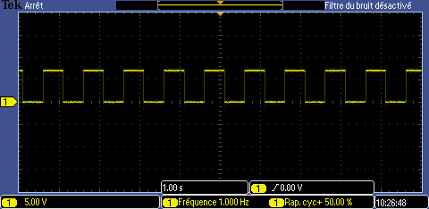
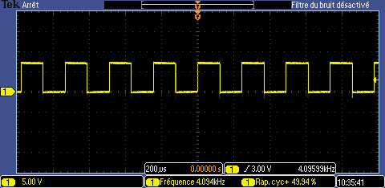

## I2C Real-Time Clock

### Pin configurations


Pin 1 - **X1** : Quartz  
Pin 2 - **X2** : Quartz  
Pin 3 - **VBAT** : Vcc battery  
Pin 4 - **GND** : Ground  
Pin 5 - **SDA** : Serial Data Input/Output  
Pin 6 - **SCL** : Serial Clock Input  
Pin 7 - **SQW/OUT** : Square Wave Output driver  
Pin 8 - **VCC**  


### How to use it

1. Connect the Quartz on pin 1 and 2
2. Connect pin 4 of Arduino(I2C) on SDA and pin 5(I2C) to SCL
3. SDA, SCL and SQW have to be connected to Vcc through pull-up resistors (min 2k)


!IMPORTANT! : If power and backup battery are removed, the clock stops and waits to be synchronized. Square wave output doesn't work either. 
So make sure to synchronize the clock before using it !!

```
RTC.begin();
RTC.adjust(DateTime(__DATE__, __TIME__));
```


### Code example

Import RTCLib into your arduino libraries directory and launch [Square wave output example](../../examples/DS1307_sqwout.ino)

### Signal output

#### 1 Hz 


#### 4.096 kHz


#### 8.192 kHz


#### 32.768 kHz


