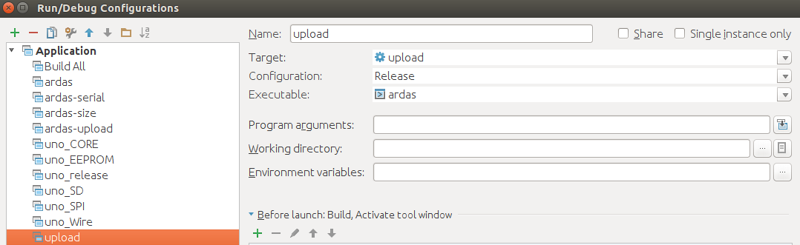

Build Arduino sketch
====================

Required libraries

* `Adafruit RTClib <https://github.com/adafruit/RTClib>`_ >= 1.0.0

Requirements
------------

Install required packages ::

    sudo apt-get install arduino cmake gcc-avr binutils-avr avr-libc avrdude

Create a directory for your project

Put the `arduino cmake directory <https://github.com/queezythegreat/arduino-cmake>`_ inside this directory

Create a CMakeLists.txt and modify it to your needs ::

    cmake_minimum_required(VERSION 2.8)
    set(CMAKE_TOOLCHAIN_FILE ${CMAKE_SOURCE_DIR}/cmake/ArduinoToolchain.cmake)
    set(PROJECT_NAME ardas)
    project(${PROJECT_NAME})
    link_directories(${CMAKE_CURRENT_SOURCE_DIR}/libraries)
    set(${CMAKE_PROJECT_NAME}_SKETCH ardas.ino)
    generate_arduino_firmware(${CMAKE_PROJECT_NAME}
        SERIAL cutecom @SERIAL_PORT@ -b 9600 -l
        PORT  /dev/ttyACM0
        BOARD uno
    )

Build and upload to arduino board
---------------------------------

Compile ::

    make

Upload ::

    make upload

Work in Clion
-------------

Copy the .ino file inside this directory and open it with Clion

Edit the configuration

   Arduino Clion config
